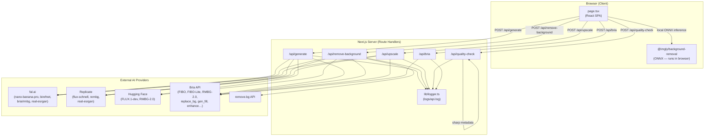
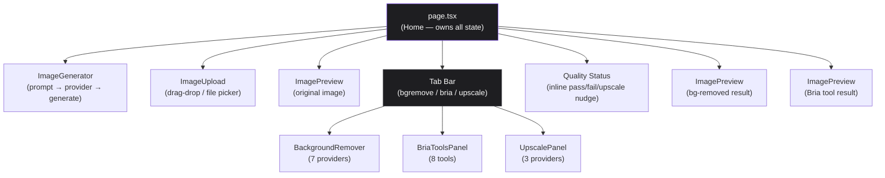
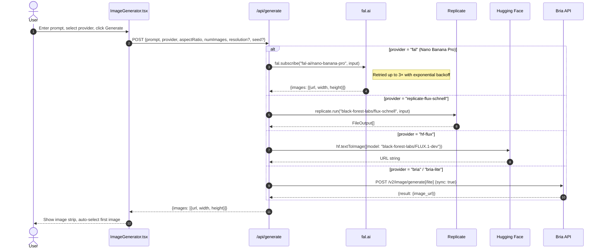
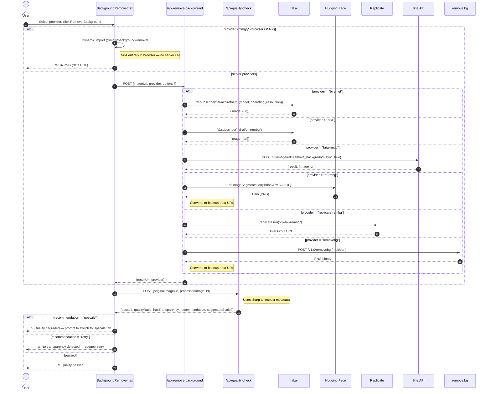
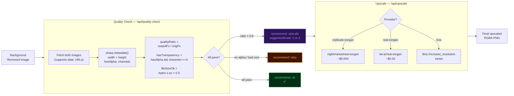
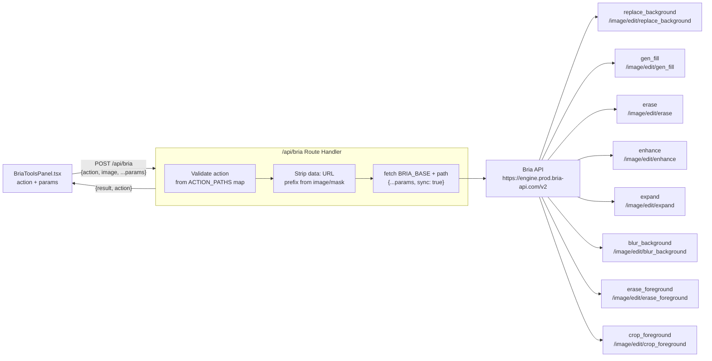
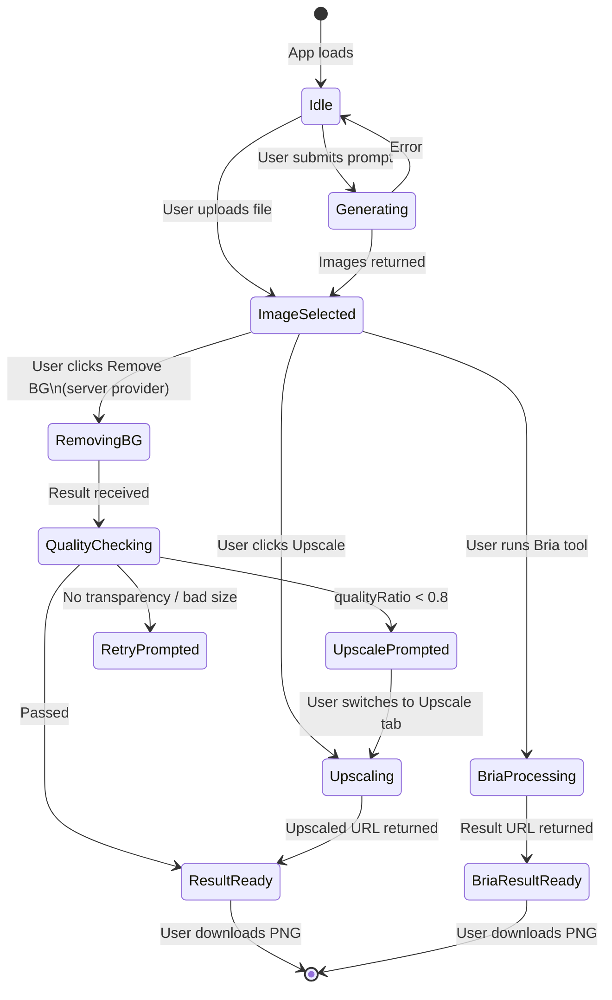

# bgrmv — Architecture Documentation

> AI image generation + precision background removal
> **Stack:** Next.js 14 (App Router) · TypeScript · Tailwind CSS
> **Last updated:** 2026-03-17

---

## 1. System Overview

bgrmv is a single-page Next.js application that orchestrates multiple AI provider APIs from a thin server layer. The browser never holds API keys — all provider calls are proxied through Next.js Route Handlers.



---

## 2. Frontend Component Hierarchy



### State held in `page.tsx`

| State variable | Type | Purpose |
|---|---|---|
| `generatedImages` | `GeneratedImage[]` | Strip of generated images |
| `selectedImage` | `GeneratedImage \| null` | Currently active image |
| `removedUrl` | `string \| null` | BG-removed result URL |
| `removedProvider` | `string \| null` | Which provider produced the result |
| `qualityResult` | `QualityResult \| null` | Metrics from quality check |
| `qualityChecking` | `boolean` | Quality check in flight |
| `finalUrl` / `finalSize` | `string \| null` | Upscaled output |
| `briaResultUrl` | `string \| null` | Bria tool output |
| `briaToolUsed` | `string \| null` | Which Bria tool ran |
| `activeTab` | `"bgremove" \| "bria" \| "upscale"` | Active panel tab |

---

## 3. Image Generation Pipeline



### Generation Provider Matrix

| Provider Key | Model ID | Platform | Cost/image | Multi-image | Resolution control |
|---|---|---|---|---|---|
| `replicate-flux-schnell` | `black-forest-labs/flux-schnell` | Replicate | ~$0.003 | ✅ up to 4 | aspect ratio only |
| `hf-flux` | `black-forest-labs/FLUX.1-dev` | Hugging Face | ~$0.005 | ❌ | none |
| `bria` | FIBO (standard) | Bria API | varies | ❌ | 1MP fixed |
| `bria-lite` | FIBO Lite | Bria API | varies | ❌ | none |
| `fal` | `fal-ai/nano-banana-pro` | fal.ai | ~$0.04 | ✅ up to 4 | 1K / 2K / 4K |

---

## 4. Background Removal Pipeline



### Background Removal Provider Matrix

| Provider Key | Model | Platform | Cost/image | Quality | Output format |
|---|---|---|---|---|---|
| `birefnet` | BiRefNet v2 | fal.ai | ~$0.02 | S-tier | PNG URL |
| `bria` | BRIA RMBG-2.0 | fal.ai | ~$0.02 | S-tier | PNG URL |
| `bria-rmbg` | BRIA RMBG-2.0 | Bria direct API | varies | S-tier | URL |
| `hf-rmbg` | briaai/RMBG-2.0 | Hugging Face | ~$0.001 | A-tier | data URL |
| `replicate-rembg` | cjwbw/rembg | Replicate | ~$0.004 | A-tier | URL |
| `removebg` | Proprietary | remove.bg | ~$0.07 | B-tier | data URL |
| `imgly` | ISNet (ONNX) | Browser | Free | B-tier | data URL |

---

## 5. Quality Check + Upscaling Pipeline



### Quality Check Logic (code-level)

```
passed = (qualityRatio >= 0.8) AND hasTransparency AND fileSizeOk

recommendation:
  fileSizeOk === false  → "retry"   (provider returned garbage)
  qualityRatio < 0.8    → "upscale" (resolution degraded)
  hasTransparency false → "retry"   (alpha channel missing)
  otherwise             → "ok"

suggestedScale:
  maxDim < 512px → 4×
  else           → 2×
```

---

## 6. Bria AI Tools Pipeline

The `/api/bria` route is a **generic action dispatcher** — a single endpoint that maps an `action` string to a Bria API path and forwards all remaining params.



---

## 7. API Route Reference

| Route | Method | Required body fields | Returns |
|---|---|---|---|
| `/api/generate` | POST | `prompt` | `{images: [{url, width, height}]}` |
| `/api/remove-background` | POST | `imageUrl` | `{resultUrl, provider}` |
| `/api/upscale` | POST | `imageUrl` | `{resultUrl, originalSize, outputSize, scaleApplied}` |
| `/api/quality-check` | POST | `originalImageUrl`, `processedImageUrl` | `{passed, qualityRatio, hasTransparency, recommendation, suggestedScale?, originalSize, outputSize}` |
| `/api/bria` | POST | `action`, `image` (+ action-specific) | `{result: {image_url}, action}` |

### Error Responses (all routes)
```json
{ "error": "Human-readable message" }
```
HTTP status: `400` for missing/invalid params, `422` for safety violations (generate), `500` for provider errors.

---

## 8. Logging (`src/lib/logger.ts`)

All route handlers emit structured log lines to `logs/api.log`. Data URLs and raw base64 strings are automatically sanitized.

```
[2026-03-17T10:00:00.000Z] REQ  /api/generate              → request  provider="fal"  prompt="a cat..."
[2026-03-17T10:00:04.382Z] OK   /api/generate              ← 4382ms   provider="fal"  images=1
[2026-03-17T10:00:04.500Z] REQ  /api/remove-background     → request  provider="birefnet"  imageUrl="https://..."
[2026-03-17T10:00:07.120Z] OK   /api/remove-background     ← 2620ms   provider="birefnet"
[2026-03-17T10:00:07.130Z] REQ  /api/quality-check         → request  ...
[2026-03-17T10:00:07.380Z] ERR  /api/quality-check         ← 250ms    error="Failed to fetch image: 403"
```

**Sanitization rules:**
- `data:image/...;base64,...` strings → `[~NNkB base64]`
- Raw base64 > 200 chars with no whitespace → `[~NNkB base64]`
- Strings > 100 chars → truncated with `...`

---

## 9. Environment Variables

| Variable | Used by routes | Required? |
|---|---|---|
| `FAL_KEY` | `/api/generate`, `/api/remove-background`, `/api/upscale` | For fal.ai providers |
| `REPLICATE_API_TOKEN` | `/api/generate`, `/api/remove-background`, `/api/upscale` | For Replicate providers |
| `HF_TOKEN` | `/api/generate`, `/api/remove-background` | For Hugging Face providers |
| `BRIA_API_TOKEN` | `/api/generate`, `/api/remove-background`, `/api/upscale`, `/api/bria` | For all Bria providers |
| `REMOVE_BG_API_KEY` | `/api/remove-background` | For `removebg` provider only |

All variables are read at **request time** (not module init), so missing keys fail gracefully with a 500 error per-request rather than crashing the server.

---

## 10. User Journey



---

## 11. File Structure

```
bgrmv/
├── src/
│   ├── app/
│   │   ├── layout.tsx            # Root layout — Geist font, metadata
│   │   ├── page.tsx              # Main SPA — owns all state
│   │   ├── globals.css           # Design tokens + animation utilities
│   │   └── api/
│   │       ├── generate/         # Image generation (4 providers)
│   │       ├── remove-background/# BG removal (6 server providers)
│   │       ├── upscale/          # Upscaling (3 providers)
│   │       ├── quality-check/    # sharp-based quality gate
│   │       └── bria/             # Generic Bria action dispatcher
│   ├── components/
│   │   ├── ImageGenerator.tsx    # Prompt form + model picker
│   │   ├── ImageUpload.tsx       # Drag-drop file upload
│   │   ├── ImagePreview.tsx      # Image display + download
│   │   ├── BackgroundRemover.tsx # 7-provider BG removal UI
│   │   ├── BriaToolsPanel.tsx    # 8 Bria editing tools
│   │   └── UpscalePanel.tsx      # 3-provider upscale UI
│   └── lib/
│       └── logger.ts             # Structured file logger
├── skills/                       # Agent skill documentation
│   ├── generate-image.md
│   ├── remove-background.md
│   ├── upscale-image.md
│   └── quality-check.md
├── .interface-design/
│   └── system.md                 # Design token system (Neural Dark)
├── agents.md                     # Agent role manifest
├── ARCHITECTURE.md               # This file
└── README.md
```
